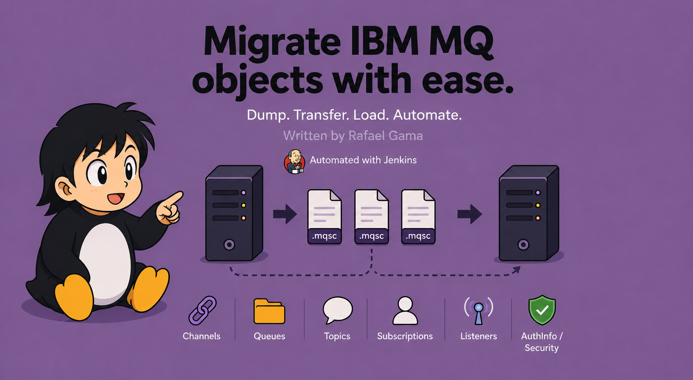
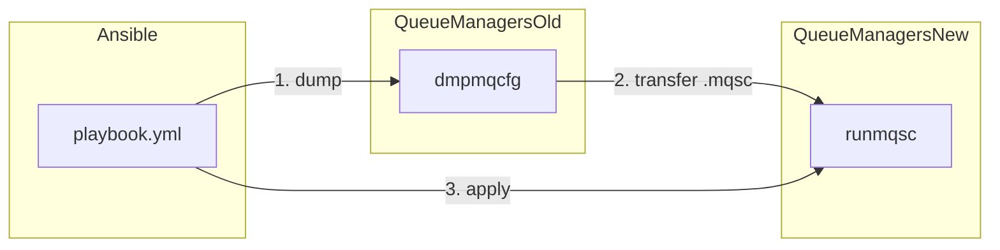
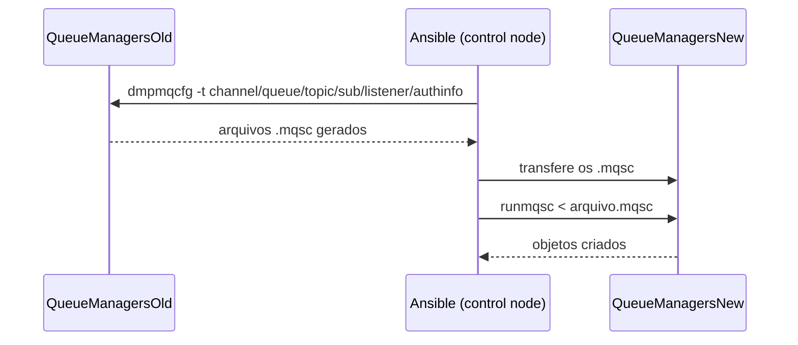
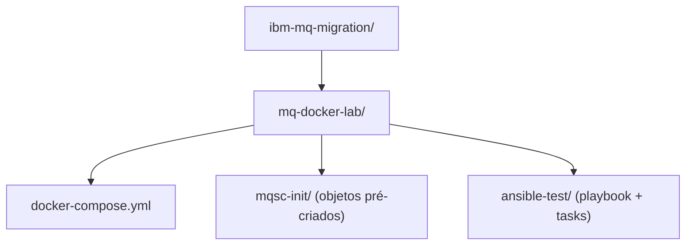

# IBM MQ Migration Lab

Ambiente de teste para validar a migração de objetos do IBM MQ (filas,
canais, tópicos, subscrições, listeners e whitelist de IP) de servidores
antigos para novos, usando Ansible — sem precisar tocar em produção.

## Como funciona



1. **Dump** — `dmpmqcfg` extrai a configuração do Queue Manager antigo em arquivos `.mqsc`
2. **Transfer** — os arquivos vão direto do servidor antigo para o novo
3. **Apply** — `runmqsc` aplica os arquivos no Queue Manager novo

## Fluxo de uma migração



## Uso rápido

```bash
# 1. Sobe o ambiente de teste
cd mq-docker-lab
docker compose up -d

# 2. Roda a migração de teste
cd ansible-test
ansible-playbook playbook.yml -e "qm_filter=QueueManagersOld"
```

## Migrando só um tipo de objeto

Útil para testar e debugar isoladamente:

```bash
ansible-playbook playbook.yml -e "qm_filter=QueueManagersOld" -e "object_filter=queue"
ansible-playbook playbook.yml -e "qm_filter=QueueManagersOld" -e "object_filter=queue,channel"
```

Valores aceitos: `channel`, `queue`, `topic`, `sub`, `listener`, `authinfo`.

## Estrutura



> O projeto de produção (conexão SSH real, senhas via vault) não faz
> parte deste repositório de teste.

---

Written by Rafael Gama
