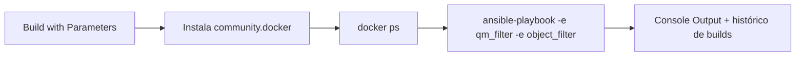

# Jenkins Integrations

Interface web para disparar as migrações do `mq-docker-lab` sem precisar
digitar comandos Ansible no terminal — com histórico, logs e parâmetros
clicáveis.

> O Jenkins **não** sabe nada sobre MQ. Ele só chama
> `ansible-playbook playbook.yml -e "qm_filter=..." -e "object_filter=..."`
> — toda a lógica de migração continua no projeto `mq-docker-lab`.

## Passo 1 — Descobrir o GID do grupo docker do seu host

O container do Jenkins precisa falar com o Docker do seu computador
(mesmo daemon que roda os containers do lab). Para isso funcionar sem
rodar como root, ele precisa entrar num grupo com o mesmo ID do grupo
`docker` do seu host:

```bash
getent group docker | cut -d: -f3
```

Anote o número que aparecer (geralmente `999` ou `998`).

## Passo 2 — Subir o Jenkins

```bash
cd jenkins-integrations
DOCKER_GID=<numero_do_passo_1> docker compose up -d --build
```

Acompanhe a subida:

```bash
docker compose logs -f jenkins
```

## Passo 3 — Pegar a senha inicial e abrir a interface

```bash
docker exec jenkins-mq cat /var/jenkins_home/secrets/initialAdminPassword
```

Abra `http://localhost:8080`, cole a senha, e escolha **"Install
suggested plugins"** no assistente inicial. Crie seu usuário admin
quando pedir.

## Passo 4 — Criar o pipeline

1. **New Item** → nome `mq-migration` → tipo **Pipeline** → OK
2. Em **Pipeline**, no campo **Definition**, escolha
   **"Pipeline script from SCM"**
3. **SCM**: `Git`
4. **Repository URL**: a URL do seu repositório (`ibm-mq-migration`)
5. **Branch**: `main` (ou a que você usa)
6. **Script Path**: `jenkins-integrations/Jenkinsfile`
7. Salvar

## Passo 5 — Subir o ambiente MQ (se ainda não estiver de pé)

```bash
cd ../mq-docker-lab
docker compose up -d
```

## Passo 6 — Rodar

No job `mq-migration`, clique em **Build with Parameters**:

- **QM_FILTER**: escolha o Queue Manager (`PVCL01`, `PVCL02`, etc.)
- **OBJECT_FILTER**: deixe vazio para migrar tudo, ou digite algo como
  `queue,channel` para migrar só um subconjunto

Clique em **Build**. Acompanhe em tempo real pelo **Console Output**.

## O que o pipeline faz



## Limitações desta primeira versão

- Aponta só para o **ambiente de teste** (`mq-docker-lab`), não para
  produção — o projeto `mq-migration-ansible` fica fora do
  repositório de propósito (senhas via vault).
- Sem gestão de credenciais ainda (não precisa, o lab não usa senha).
- Quando for a hora de apontar para produção, os próximos passos são:
  guardar a senha do `ansible-vault` como _Secret text_ em
  **Manage Jenkins → Credentials**, montar/checkar o projeto
  `mq-migration-ansible` de outra forma (ele está fora do git), e
  passar `--vault-password-file` no `sh` do Jenkinsfile.

---

Written by Rafael Gama
